# Intelligent Traffic Control Architecture & Operational Specification (Phase 6)

This document provides technical architecture, mathematical models, safety validation invariants, operational rule hierarchies, point-queue simulation formulations, and documented engineering limits for the intelligent traffic control plane in **AI TrafficOS**.

---

## 1. Architectural Mandate: Supervisory Recommendation Invariant

> [!IMPORTANT]
> **CRITICAL ARCHITECTURAL SAFETY INVARIANT:**
> The control subsystem in AI TrafficOS functions strictly as a **supervisory, advisory decision-support system**. 
> All outputs emitted by the decision engine, optimizer, and emergency orchestrator carry `is_recommendation = True`.
> 
> Under no circumstances does AI TrafficOS:
> 1. Actuate physical field signal controllers directly.
> 2. Bypass, override, or replace certified intersection hardware safety devices, including Malfunction Management Units (MMU) or Conflict Monitor Units (CMU).
> 3. Suppress hardware clearance intervals (yellow change and all-red clearance intervals).
> 
> All proposed plans require either **explicit human supervisory review and approval** by a certified Traffic Officer, or downstream translation through certified NTCIP 1202 field gateway middleware enforcing local cabinet interlocks.

---

## 2. End-to-End Control-Plane Architecture

The control plane continuously transforms real-time sensor observations and predictive machine learning forecasts into safety-certified supervisory signal timing plans and incident management advisories.

```mermaid
flowchart LR
    A["1. Computer Vision & Ingest<br/>(YOLO / Sensors)"] --> B["2. Live State Assembly<br/>(TrafficStateBuilder)"]
    B --> C["3. ML Predictive Pipeline<br/>(TrafficForecaster)"]
    B --> D["4. Rule Hierarchy & Decision Engine<br/>(DecisionEngine)"]
    C --> D
    D --> E["5. Webster-Inspired Optimizer<br/>(SignalOptimizer)"]
    E --> F["6. Simulation & Safety Verification<br/>(WhatIfSimulator + SafetyValidator)"]
    F --> G["7. Advisory Recommendation<br/>(is_recommendation = True)"]
    G --> H["8. Human Supervisory Action<br/>(Apply / Revert / Override)"]
    H --> I["9. Immutable Audit & Telemetry<br/>(AuditLog + Notifications)"]
```

### Pipeline Stages

1. **Computer Vision & Sensor Ingest (CV)**:
   Extracts vehicular bounding boxes, per-lane velocities, localized density, and stop-bar queues from field cameras and radar/induction detectors, persisting snapshots to `traffic_records`.
2. **Live State Assembly (State)**:
   `TrafficStateBuilder` compiles latest traffic metrics, active emergency presence, optical signal status, and unresolved incident counts into a frozen `TrafficState` dataclass.
3. **Predictive Forecasting (Prediction)**:
   The multi-target gradient boosted forecaster (`TrafficForecaster`) produces 30-minute forward horizons for volume, congestion, and queue growth rate with confidence bounds.
4. **Deterministic Rule Evaluation (Decision)**:
   `evaluate_control_rules` prioritizes emergency transits, severe spillback risks, and split adjustments in a strict, deterministic hierarchy.
5. **Optimization (Optimization)**:
   `SignalOptimizer` dynamically distributes cycle green budgets across phases using Webster-inspired queue-proportional allocation subject to statutory bounds $[G_{\text{min}}, G_{\text{max}}]$.
6. **Simulation & Safety Verification (Simulation/Validation)**:
   `WhatIfSimulator` evaluates candidate plans against baselines using macroscopic point-queue dynamics without fabricating percentage claims. `SafetyValidator` authoritatively verifies timing bounds, cyclic order, and movement conflict matrices.
7. **Advisory Proposal (Recommendation)**:
   Persists candidate actions in `ai_decisions` under status `proposed`.
8. **Supervisory Approval (Audit/Realtime)**:
   Traffic Officers review recommendations, applying or reverting them through authenticated REST endpoints while recording every state change in `audit_logs`.

---

## 3. Decision Rule Hierarchy & Thresholds

Rules are evaluated in strict priority order. The first rule whose precondition is met fires; lower-priority rules are skipped.

| Priority | Directive | Action Type | Preconditions | Operational Defaults (Tunable) |
| :---: | :--- | :--- | :--- | :--- |
| **1** | Emergency Preemption | `PRIORITIZE_EMERGENCY` | Active emergency transit within junction or adjacent corridor segment | `active_emergency == True` |
| **2** | Arterial Rerouting | `REROUTE_TRAFFIC` | Critical queue threshold reached AND predicted queue expanding rapidly | `queue_length >= 25.0` veh `predicted.queue_growth > 2.0` |
| **3** | Congestion Split Extension | `EXTEND_GREEN` | Heavy queue or severe density/occupancy on monitored approach | `queue_length >= 15.0` veh OR `density >= 0.70` OR `occupancy >= 0.75` |
| **4** | Off-Peak Split Reduction | `REDUCE_GREEN` | Starved approach with minimal queue and negligible density | `queue_length <= 3.0` veh AND `density <= 0.15` |
| **5** | Baseline Coordination | `NO_ACTION` | Conditions within standard operational parameters | Default fallback |

> [!NOTE]
> All numerical thresholds (`QUEUE_LENGTH_REROUTE_THRESHOLD = 25.0`, `QUEUE_GROWTH_REROUTE_THRESHOLD = 2.0`, `QUEUE_LENGTH_EXTEND_GREEN_THRESHOLD = 15.0`, `QUEUE_LENGTH_REDUCE_GREEN_THRESHOLD = 3.0`, `DENSITY_REDUCE_GREEN_THRESHOLD = 0.15`) are configured as **tunable operational defaults** in `app.services.control.rules` and may be adapted to local municipal highway authority standards.

---

## 4. Signal Optimizer Mathematical Formulation

The optimizer uses a Webster-inspired queue-proportional allocation algorithm to allocate discretionary cycle time while guaranteeing statutory clearance and pedestrian crossing minimums.

### Composite Phase Demand Score ($S_i$)

For each phase $i$, a composite demand score is computed from observed traffic metrics, predictive modifiers, and geometry:

$$S_i = \left( w_q \cdot Q_i + w_k \cdot K_i + w_v \cdot V_i \right) \cdot M_{\text{pred}} \cdot M_{\text{em}} \cdot \frac{1}{\sqrt{L_i}}$$

Where:
- $Q_i$: Observed stop-bar queue (vehicles), weight $w_q = 0.50$.
- $K_i$: Normalized approach lane density $[0.0, 1.0]$, weight $w_k = 0.25$.
- $V_i$: Normalized vehicular arrival flow rate $\min(1.0, \text{flow} / 60.0)$, weight $w_v = 0.25$.
- $M_{\text{pred}}$: Predictive multiplier based on 30-minute forward congestion forecast $C_{\text{pred}} \in [0, 100]$:
  $$M_{\text{pred}} = 1.0 + \frac{C_{\text{pred}}}{200.0} \quad \in [1.0, 1.5]$$
- $M_{\text{em}}$: Emergency corridor priority boost ($1.50$ if phase lies on active route, $1.00$ otherwise).
- $L_i$: Approach lane count (de-rates single-lane bottleneck scores relative to multi-lane capacity).

### Cycle Green Budget & Split Distribution

1. **Lost Time & Clearance Accounting:**
   Total clearance lost time across $N$ active phases:
   $$L_{\text{total}} = \sum_{i=1}^N (Y_i + R_i)$$
   Where $Y_i$ is yellow change interval (default $3.0$s) and $R_i$ is all-red clearance interval (default $2.0$s).

2. **Discretionary Green Budget ($G_{\text{disc}}$):**
   Given target cycle length $C_{\text{target}}$ (default $90.0$s) and statutory minimum green $G_{\text{min}}$ (default $7.0$s):
   $$G_{\text{disc}} = \max\left(0, C_{\text{target}} - (N \cdot G_{\text{min}}) - L_{\text{total}}\right)$$

3. **Demand-Proportional Green Allocation ($g_i$):**
   If total demand score $\sum_j S_j > 0$:
   $$g_i = \text{clamp}\left(G_{\text{min}} + G_{\text{disc}} \cdot \frac{S_i}{\sum_{j=1}^N S_j}, \; G_{\text{min}}, \; G_{\text{max}}\right)$$
   If total demand score is zero across all phases, each phase receives $g_i = G_{\text{min}}$.

4. **Total Cycle Normalization:**
   Total operational cycle time is computed as the exact sum of allocated greens and clearances:
   $$C_{\text{total}} = \sum_{i=1}^N g_i + L_{\text{total}}$$

---

## 5. Authoritative Safety Validation Gateway

The `SafetyValidator` serves as an immutable gatekeeper. Any candidate timing plan or phase transition that fails validation is rejected with `UnsafeStateError` (HTTP 422), preventing unsafe directives from reaching supervisory operators.

### Invariants Enforced

1. **Statutory Timing Bounds:**
   Every proposed phase green $g_i$ strictly satisfies:
   $$G_{\text{min}} \le g_i \le G_{\text{max}}$$
   - Prevents dilemma-zone indecision and pedestrian clearance truncation ($g_i < G_{\text{min}}$).
   - Prevents cross-street traffic starvation and driver red-running ($g_i > G_{\text{max}}$).

2. **Strict Cyclic Progression & Inactive Lockout:**
   - Sequential progression must follow configured `phase_order` without skipping active phases.
   - Wrap-around transitions from the highest `phase_order` back to the lowest are permitted.
   - Phases with `is_active = False` are strictly locked out; allocating green or transitioning to an inactive phase triggers immediate rejection.
   - Green extension on the current active phase (`from_phase_id == to_phase_id`) is valid.

3. **Heuristic Conflict Monitor Unit (CMU):**
   Every concurrent green pair is evaluated:
   - **Compatible Movements**: Opposing through movements along the same arterial axis (Northbound Through vs. Southbound Through; Eastbound Through vs. Westbound Through) and dual protected left turns (NB Left + SB Left; EB Left + WB Left).
   - **Conflicting Movements**: Crossing perpendicular approaches (e.g., North-South vs. East-West) or left-turn movements cutting across opposing through paths.
   - **Explicit Compatibility**: Phases containing matching `compatible_with:<marker>` tokens.
   - Any pair lacking verified directional clearance raises `UnsafeStateError` naming both conflicting phases.

4. **Sensor Telemetry Freshness:**
   Plans must not be formulated on stale telemetry. Telemetry age $T_{\text{age}} = t_{\text{now}} - t_{\text{recorded}}$ must not exceed $T_{\text{max}}$ (default $300.0$ seconds). Violations raise `StaleTelemetryError`.

---

## 6. What-If Simulator: Macroscopic Point-Queue Model

The `WhatIfSimulator` allows supervisory operators to compare baseline and proposed signal plans prior to manual approval.

### Point-Queue Formulation

The simulator operates as a discrete-time macroscopic point-queue model with step size $\Delta t = 5.0$ seconds across horizon $H = 15$ minutes:

$$\text{Arrivals: } A(t) = \lambda \cdot \Delta t$$

$$\text{Capacity: } C(t) = \begin{cases} s \cdot \Delta t & \text{if phase is GREEN} \\ 0 & \text{if YELLOW, RED, or ALL-RED} \end{cases}$$

$$\text{Queue Update: } Q(t + \Delta t) = \max\left(0, \; Q(t) + A(t) - C(t)\right)$$

$$\text{Departures (Throughput): } D(t) = \min\left(Q(t) + A(t), \; C(t)\right)$$

$$\text{Waiting Delay: } W_{\text{cum}} = \sum_{t=0}^H Q(t) \cdot \frac{\Delta t}{60} \quad \text{[vehicle-minutes]}$$

### Honest Model Limits & Diagnostic Principles

> [!WARNING]
> **SIMULATION FIDELITY NOTICE:**
> The simulator is a **planning-grade macroscopic point-queue model**, NOT a microscopic multi-agent simulator (such as SUMO, VISSIM, or Aimsun).
> 
> **Key Limitations:**
> 1. Does not model car-following physics, lane changes, spillback blocking upstream intersections, or driver perception-reaction variance.
> 2. Assumes uniform vehicle arrivals ($\lambda$) and constant saturation flow ($s = 30$ veh/min/lane default).
> 3. Does not fabricate marketing claims or percentage improvements (e.g., "reduces emissions by 14%").
> 4. Reports only raw, physical metrics: wait time delta ($\Delta W$ veh$\cdot$min), average queue delta ($\Delta \bar{Q}$ veh), throughput delta ($\Delta D$), and residual queue at horizon end ($Q_{\text{residual}}$).
> 5. Oversaturated bottlenecks are explicitly reported in diagnostic notes rather than masked.

---

## 7. Emergency Green Corridor Preemption

The emergency priority subsystem coordinates route preemption for active response vehicles:

1. **Origin Detection**: Resolves emergency origin directly from linked incident intersection coordinates or vehicle GPS without guessing.
2. **Corridor Routing**: Calculates optimal green wave paths using A* search weighted by live arterial speed limits and road congestion.
3. **Preemption Schedule**: Projects arrival timestamps at successive downstream signals based on cruising emergency speeds ($60$ km/h nominal).
4. **Safety Check**: Validates every signal action along the corridor against the `SafetyValidator` before proposing preemption splits.
5. **Conflict Resolution**: Multi-vehicle right-of-way disputes are resolved using strict triage conventions (critical severity outranks high; FIFO fairness for equal priority).
6. **Restoration**: Once the emergency vehicle concludes transit, an advisory `NO_ACTION` directive is emitted to return signals to standard cyclic coordination.

---

## 8. REST API Summary

All routes are registered under prefix `/api/v1/control` and require valid JWT authentication.

| Method | Path | Auth / Role | Description |
| :--- | :--- | :--- | :--- |
| `POST` | `/recommendations` | Analyst+ | Evaluate live telemetry & forecasts to produce supervisory recommendation |
| `POST` | `/optimize-signals` | Officer / Admin | Calculate Webster queue-proportional splits & execute safety validation |
| `POST` | `/simulate` | Analyst+ | Point-queue simulation comparing baseline vs. proposed plans |
| `POST` | `/emergency/prioritize` | Officer / Admin | Activate advisory green corridor preemption for active emergency |
| `POST` | `/emergency/restore` | Officer / Admin | Conclude emergency preemption; restore standard signal plan |
| `POST` | `/green-corridor/recommend` | Officer / Admin | Read-only candidate emergency corridor calculation (no DB writes) |
| `GET` | `/decisions` | Analyst+ | Paginated history of generated supervisory control decisions |
| `GET` | `/decisions/{id}` | Analyst+ | Retrieve single advisory decision with full JSON payload |
| `POST` | `/decisions/{id}/apply` | Officer / Admin | Transition decision status from `proposed` to `applied` |
| `POST` | `/decisions/{id}/revert` | Officer / Admin | Transition decision status to `reverted` |
| `GET` | `/junctions/{id}/control-status` | Analyst+ | Real-time junction control health, telemetry age, signal state, and incidents |

---

## 9. Telemetry Freshness Policy

To prevent dangerous open-loop recommendations without live environmental verification, the control plane enforces a strict freshness cutoff:
- **Maximum Permissible Age**: $300.0$ seconds ($5.0$ minutes).
- **Behavior on Stale Data**:
  - `POST /recommendations`: Returns HTTP `422 Unprocessable Entity` with message `Telemetry for intersection {id} is stale: age {T}s exceeds threshold 300.0s.`
  - `GET /junctions/{id}/control-status`: Returns calculated `latest_telemetry_age_s` without error, allowing operators to detect offline sensors.
  - In unattended background polling, `DecisionEngine` gracefully falls back to `NO_ACTION` with an advisory note citing stale telemetry.

---

## 10. Documented Engineering Limitations

1. **Hardware DI/DO Isolation**: AI TrafficOS produces supervisory timing recommendations; it does not interface directly with field load switches or 120V AC signal heads.
2. **Conflict Matrix Heuristics**: Pending municipal deployment of a NEMA TS-2 channel conflict database schema, conflict detection relies on directional token parsing. Movements with ambiguous naming are conservatively treated as conflicting.
3. **Single-Junction Optimization**: Split optimization operates locally per intersection. Network-wide arterial coordination (offsets and progression band optimization) is coordinated via the green wave corridor orchestrator.
4. **Pedestrian Phasing**: Pedestrian call actuation is modeled as a minimum green timing constraint ($G_{\text{min}} \ge 7.0$s) rather than independent pedestrian phase interval tracking.
